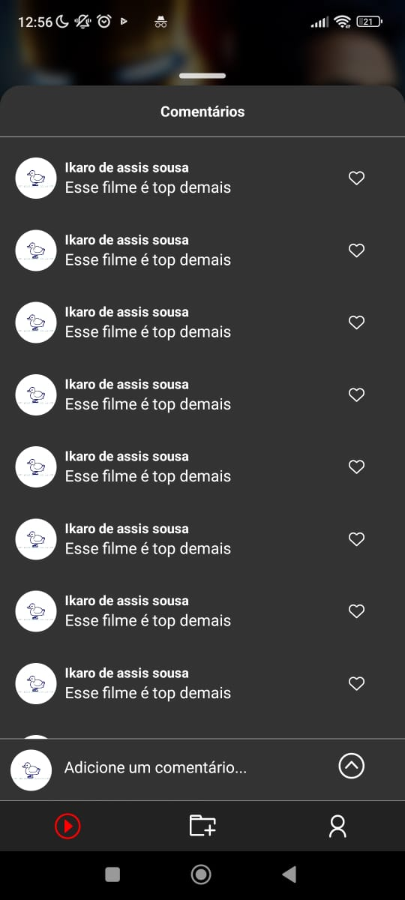

   
  <h1 align="center">Duck Flix</h1>

 

# Sobre o projeto
### uma plataforma de filmes desenvolvida com React Native! Este projeto visa proporcionar uma experiência completa de navegação e visualização de filmes diretamente no seu dispositivo móvel. Abaixo, você encontrará detalhes sobre as tecnologias e bibliotecas utilizadas.
## Layout 

- React Native
- TypeScript
- Json-server
- Expo

# Autor

## @Duck.Web

<!-- INSTAGRAM -->

